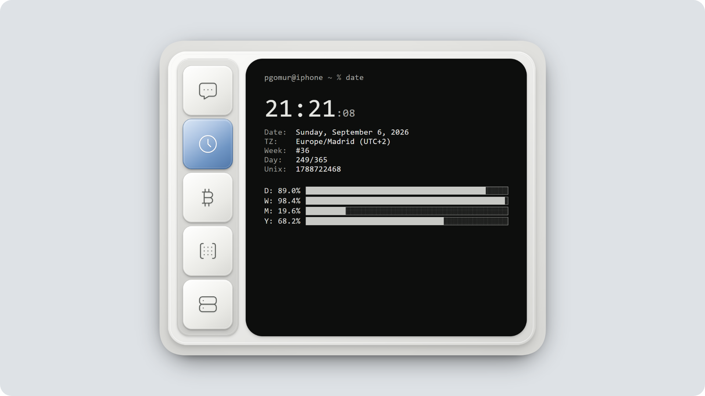

# Pocket Terminal

  
  
  
  
  
  

**Visual and interactive concept / prototype.** A personal terminal in the form of a portable device (a "pocket device"), rendered entirely in the browser. It is not an emulator or a general-purpose functional app: it's a UX and design exploration studying what it would be like to embed a terminal GUI in a physical pocket gadget (housing, navigation rail, and glass screen) using only web technologies.

Each application behaves like a terminal session: it shows its own prompt (`pgomur@iphone ~ %`) and exposes all information through a textual representation, with no native widgets.

## Rendering architecture

The device is built entirely from Svelte-generated DOM/CSS — housing, screen, and applications alike. The device's scale is responsive via container query units relative to the actual width of the container, so a single pixel-based design spec adapts to any screen size without breakpoint-based media queries.

Routing between applications is based on a typed identifier with five possible values (the five apps), which the screen view switches between via conditional rendering; the navigation rail is bidirectionally bound to the active app. Icons are custom-drawn, soft-edged SVGs with rounded strokes and line caps, with no external icon library.

## Applications

### Chat

A text assistant running **100% client-side** — no server, no external API — via Hugging Face's transformers library, which runs the Qwen2.5-Coder-0.5B instruct model inside a Web Worker.

- **Deferred startup**: the worker and the model are only initialized the first time the app is opened in the session; the state lives in a module singleton that survives the view being mounted and unmounted.
- **Runtime detection**: on load, the worker checks for WebGPU availability and starts with 4-bit floating-point quantization; if that fails, it automatically falls back to WASM with 4-bit integer quantization. The actual runtime/precision combination is reported back to the client and shown on screen.
- **Generation parameters**: 200-token limit, greedy decoding (no random sampling), repetition penalty, and a no-repeat n-gram size of 3 to prevent loops.
- **Adaptive context window**: the number of messages sent to the model is computed via a heuristic based on the runtime and the device's actual hardware (CPU cores and memory), with a base of 6 messages, increments/decrements depending on capability, and a bounded range between 4 and 20. Messages that fall outside the window are dropped and counted on screen.
- **Model management from the terminal itself**: the help command lists the available commands; clearing the conversation (keeping the model loaded); deleting the downloaded model, destroying the worker and purging the browser cache that stores the model; and re-downloading it, rebuilding the worker without needing to reload the page.
- **Download progress**: the worker emits per-file progress events with bytes downloaded and total bytes, which feed the UI's progress bar.
- **System prompt**: Instructing it to reply in the language of the user's last message, concisely, in plain text, with no markdown.

### Clock

A digital clock synced to the second boundary: the first tick is scheduled to occur exactly at the start of the next second, and periodic ticks follow from there without accumulating drift. It computes day, week (Monday to Sunday), month, and year progress as a percentage; ISO 8601 week number, day of year (with leap-year correction), Unix timestamp, and UTC offset.

### Bitcoin

Live data from the CoinGecko API (instant price with aggregated metrics and a 7-day historical series at hourly resolution), with automatic refresh every 60 seconds.

- **ASCII chart**: the 7-day series is resampled to the container's width via uniform sampling and rasterized onto a fixed-height grid (10 rows) using box-drawing characters to trace rises, drops, and flat stretches. The Y axis shows 4 compact price labels, and the X axis shows relative time labels from 7 days ago to "now".
- **Reactive typographic measurement**: a hidden element measures the exact width of a character in the terminal's font, and a resize observer on the container and its parent element regenerates the chart's columns when the size changes.
- **24h high/low** derived from the last 24 hourly points of the series, not from the endpoint.

### Life

Conway's Game of Life on a toroidal grid (the neighborhood wraps around the edges), where each cell stores its age — consecutive generations alive — instead of a boolean state, which allows styling cells by longevity.

- **Rotating seed generator**: four curated archetypes chosen cyclically — dense clusters of viable polyominoes with a central methuselah; quarter-turn symmetry generated from coordinate pairs; opposing spaceship fleets with a central methuselah; and a glider gun or a puffer train with corner blocks.
- **Autonomous lifecycle**: the board runs autonomously with a 140ms tick. It detects closed cycles via a fast 32-bit hash of the boolean grid (a 48-generation window), stagnation (identical population with zero changes for 4 generations), and static low density. Before resetting, it injects up to 3 spaceships as a kinetic perturbation to revive the board; if the board does not recover, it reseeds. A reseed is also forced upon reaching 800 generations or zero population.
- **Per-generation metrics**: population, percentage density, births and deaths, historical peak, and normalized Shannon entropy, computed over the distribution of the 16 possible 2×2 block patterns of the toroidal grid.
- **Fit-to-screen**: the number of columns and rows is derived from the real character width and the container's available height (subtracting its fixed siblings), with automatic reseeding on resize.

### System

An inventory of the device and the actual browser environment: operating system and browser detected via heuristics on the user agent (with guards to avoid false positives between Chrome, Safari, and Edge); the actual GPU renderer obtained through the WebGL debug info extension; CPU cores, device memory, screen resolution versus viewport, and device pixel ratio; WebGPU support; preferred color scheme; timezone, language, and cookies. The JavaScript process heap is sampled every second.

## Themes

The active theme is a typed identifier with six possible values, each resolved to an independent, self-contained stylesheet. All six are bundled as text at build time and injected into a single style element in the document; switching themes swaps the stylesheet text in place, with no page reload and no re-render of the application.

All of them share the same design token contract — ink color, brightness/dimming levels, label color, housing surface, screen surface — exposed via CSS variables, so no component knows or depends on the active appearance. The selection persists locally in the browser across sessions.

The selector opens from the floating button with a palette icon in the top-right corner, outside the device itself, so as not to interfere with the navigation rail or the screen's content. It's a keyboard-operated overlay, closed with Escape.

## Known limitations

- **Chat**: the model has 0.5B parameters so it can run entirely in the browser without a server. At that size, coherence and reasoning ability are limited — this is a local-inference experiment, not a reliable assistant for factual queries.
- **System**: several fields depend on non-standard APIs exposed only by Chromium-based browsers (device memory, WebGPU). On Firefox or Safari they will show as unavailable; this is a platform constraint, not an app bug.
- **Bitcoin**: uses the public, unauthenticated CoinGecko API, which is subject to a per-IP rate limit. Heavy use in a short time can cause temporary load failures.
- **Persistence**: aside from the selected theme, all state (chat conversation, Game of Life progress, etc.) lives in memory for the session and is lost on page reload.

